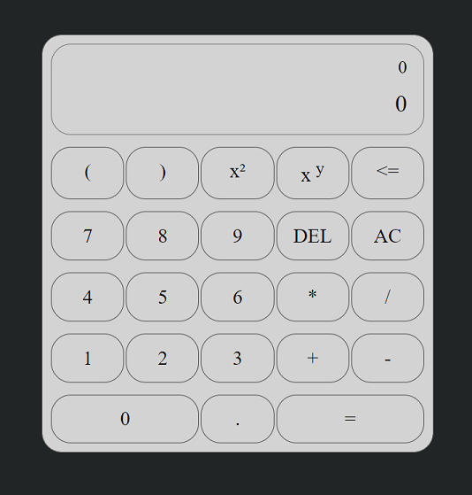

# Calculator

This project was created with simple CSS and Vanilla JS.
The calculator displays the result after the expression is translated to a postfix expression. 

The link for the GitHub Page -> https://victorgulart.github.io/Calculator/

## Calculator App
